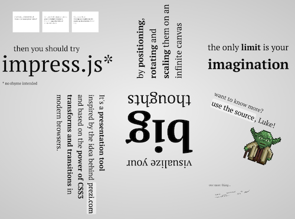

impress.js - Codio Tutorial
===========================

Impress.js is a presentation framework based on the power of CSS3 transforms and transitions in modern browsers and inspired by the idea behind prezi.com.

**WARNING : ** impress.js may not help you if you have nothing interesting to say ;)

Take the Codio:Annotations Tour
-------------------------------
This tutorial is built using Codio:Annotations features. Feel free to explore the files in the tree. You can also take a tour of the code by pressing the **tour** button at the top of the screen or, **[click here](http://annotations.test.crafted.io/fmay/impress/tour)** to start the Codio Tour.

Wherever you see blue icons, click them to see any comments.

What it looks like
------------------
The image below whos you the whole presentation. When you run it, you will see how it the presentation flows through this layout.

ABOUT THE NAME
----------------

impress.js name in [courtesy of @skuzniak](http://twitter.com/skuzniak/status/143627215165333504).

It's an (un)fortunate coincidence that a Open/LibreOffice presentation tool is called Impress ;)

HOW TO USE IT
---------------

[Use the source](http://github.com/bartaz/impress.js/blob/master/index.html), Luke ;)

If you have no idea what I mean by that, or you just clicked that link above and got 
very confused by all these strange characters that got displayed on your screen,
it's a sign, that impress.js is not for you.

Sorry.

Fortunately there are some guys on GitHub that got quite excited with the idea of building
editing tool for impress.js. Let's hope they will manage to do it.

EXAMPLES AND DEMOS
--------------------

### Official demo

[impress.js demo](http://bartaz.github.com/impress.js) by [@bartaz](http://twitter.com/bartaz)

### Other examples

More examples and demos can be found on [Examples and demos wiki page](http://github.com/bartaz/impress.js/wiki/Examples-and-demos).

Feel free to add your own example presentations (or websites) there.

WANT TO CONTRIBUTE?
---------------------

If you've found a bug or have a great idea for new feature let me know by [adding your suggestion]
(http://github.com/bartaz/impress.js/issues/new) to [issues list](https://github.com/bartaz/impress.js/issues).

If you have fixed a bug or implemented a feature that you'd like to share, send your pull request against [dev branch]
(http://github.com/bartaz/impress.js/tree/dev). But remember that I only accept code that fits my vision of impress.js
and my coding standards - so make sure you are open for discussion :)

BROWSER SUPPORT
-----------------

### TL;DR;

Currently impress.js works fine in latest Chrome/Chromium browser, Safari 5.1 and Firefox 10.
With addition of some HTML5 polyfills (see below for details) it should work in Internet Explorer 10
(currently available as Developers Preview).
It doesn't work in Opera, as it doesn't support CSS 3D transforms.

As a presentation tool it was not developed with mobile browsers in mind, but some tablets are good
enough to run it, so it should work quite well on iPad (iOS 5, or iOS 4 with HTML5 polyfills) and 
Blackberry Playbook.

### Still interested? Read more...

Additionally for the animations to run smoothly it's required to have hardware
acceleration support in your browser. This depends on the browser, your operating
system and even kind of graphic hardware you have in your machine.

For browsers not supporting CSS3 3D transforms impress.js adds `impress-not-supported`
class on `#impress` element, so fallback styles can be applied to make all the content accessible.

### Even more explanation and technical stuff

Let's put this straight -- wide browser support was (and is) not on top of my priority list for
impress.js. It's built on top of fresh technologies that just start to appear in the browsers
and I'd like to rather look forward and develop for the future than being slowed down by the past.

But it's not "hard-coded" for any particular browser or engine. If any browser in future will
support features required to run impress.js, it will just begin to work there without changes in
the code.

From technical point of view all the positioning of presentation elements in 3D requires CSS 3D
transforms support. Transitions between presentation steps are based on CSS transitions.
So these two features are required by impress.js to display presentation correctly.

Unfortunately the support for CSS 3D transforms and transitions is not enough for animations to
run smoothly. If the browser doesn't support hardware acceleration or the graphic card is not 
good enough the transitions will be laggy.

Additionally the code of impress.js relies on APIs proposed in HTML5 specification, including
`classList` and `dataset` APIs. If they are not available in the browser, impress.js will not work.

Fortunately, as these are JavaScript APIs there are polyfill libraries that patch older browsers
with these APIs.

For example IE10 is said to support CSS 3D transforms and transitions, but it doesn't have `classList`
not `dataset` APIs implemented at the moment. So including polyfill libraries *should* help IE10
with running impress.js.

### And few more details about mobile support

Mobile browsers are currently not supported. Even Android browsers that support CSS 3D transforms are
forced into fallback view at this point.

Fortunately some tablets seem to have good enough hardware support and browsers to handle it.
Currently impress.js presentations should work on iPad and Blackberry Playbook.

In theory iPhone should also be able to run it (as it runs the same software as iPad), but I haven't
found a good way to handle it's small screen.

Also note that iOS supports `classList` and `dataset` APIs starting with version 5, so iOS 4.X and older
requires polyfills to work.

LICENSE
---------

Copyright 2011-2012 Bartek Szopka

Released under the MIT and GPL Licenses.

