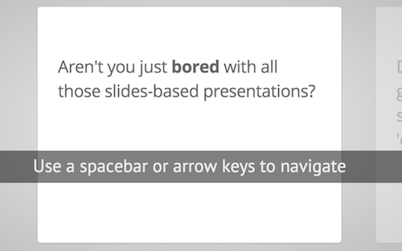

@annotation:file README.md
#The readme.md file
The `readme.md` file is a great place to place a large intro to the project as a whole. It displays as soon as the project is loaded and you can provide clear instructions to the user.

@annotation:file index.html
Everything you need to define your presentation lives in here. You can more or less ignore everything else

@annotation:file component.json
This is a json file

@annotation:file css
This folder contains the CSS file that is used to style the presentation steps. It's worth an exploration.

@annotation:file js/impress.js
You don't need to do anything other than include this file, which is the main impress.js code.

@annotation:file css/impress-demo.css
So you like the style of impress.js demo?
Or maybe you are just curious how it was done?

You couldn't find a better place to find out!

Welcome to the stylesheet impress.js demo presentation.

Please remember that it is not meant to be a part of impress.js and is
not required by impress.js.
I expect that anyone creating a presentation for impress.js would create
their own set of styles.

But feel free to read through it and learn how to get the most of what
impress.js provides.

And let me be your guide.

@annotation:tour
#How about a video
The best way to get started is to watch a video of the demo **impress.js** presentation contained within this project. You can press the Preview button at the top left of the screen to see it in your browser or run the video below. Feel free to enlarge the window.

@annotation:tour intro
#Introduction
##Welcome to the impress.js tutorial
So you'd like to know how to use impress.js?

You've made the first, **very important** step - you're reading the source code.
And that's how impress.js presentations are built - with HTML and CSS code.

Believe me, you need quite decent HTML and CSS skills to be able to use impress.js effectively.
And what is even more important, you need to be a designer, too, because there are no default
styles for impress.js presentations, there is no default or automatic layout for them.

You need to design and build it by hand.

So...

Would you still like to know how to use impress.js?

@annotation:tour css-link
Impress.js doesn't depend on any external stylesheet. Script adds all styles it needs for
presentation to work.

This style below contains styles only for demo presentation. Browse it to see how impress.js
classes are used to style presentation steps, or how to apply fallback styles, but I don't want
you to use them directly in your presentation.

Be creative, build your own. We don't really want all impress.js presentations to look the same,
do we?

When creating your own presentation get rid of this file. Start from scratch, it's fun!

@annotation:tour html-body
#Body element
The `body` element is used by impress.js to set some useful class names, that will allow you to detect
the support and state of the presentation in CSS or other scripts.

First very useful class name is `impress-not-supported`. This class means, that browser doesn't
support features required by impress.js, so you should apply some fallback styles in your CSS.
It's not necessary to add it manually on this element. If the script detects that browser is not
good enough it will add this class, but keeping it in HTML means that users without JavaScript
will also get fallback styles.

When **impress.js** script detects that browser supports all required features, this class name will
be removed.

The class name on body element also depends on currently active presentation step. More details about
it can be found later, when `hint` element is being described.
    
@annotation:tour fallback
#Fallback for unsupported browsers
For example this fallback message is only visible when there is `impress-not-supported` class on body.

@annotation:tour main-wrapper
Now that's the core element used by impress.js.

That's the wrapper for your presentation steps. In this element all the impress.js magic happens.
It doesn't have to be a `
`. Only `id` is important here as that's how the script find it.

You probably won't need it now, but there are some configuration options that can be set on this element.

To change the duration of the transition between slides use `data-transition-duration="2000"` giving it
a number of ms. It defaults to 1000 (1s).

You can also control the perspective with `data-perspective="500"` giving it a number of pixels.
It defaults to 1000. You can set it to 0 if you don't want any 3D effects.
If you are willing to change this value make sure you understand how CSS perspective works:
https://developer.mozilla.org/en/CSS/perspective

But as I said, you won't need it for now, so don't worry - there are some simple but interesing things
right around the corner of this tag ;)
    
@annotation:tour intro-comment1
#The first slide
Here is where interesting thing start to happen.

Each step of the presentation should be an element inside the `#impress` with a class name
of `step`. These step elements are positioned, rotated and scaled by impress.js, and
the 'camera' shows them on each step of the presentation. Here's the first main slide.

Positioning information is passed through data attributes.

In the example below we only specify x and y position of the step element with `data-x="-1000"`
and `data-y="-1500` attributes. This means that **the center** of the element (yes, the center)
will be positioned in point x = -1000px and y = -1500px of the presentation 'canvas'.

It will not be rotated or scaled.

@annotation:tour intro-comment2
The `id` attribute of the step element is used to identify it in the URL, but it's optional.
If it is not defined, it will get a default value of `step-N` where N is a number of slide.

So in the example below it'll be `step-2`.

The hash part of the url when this step is active will be `#/step-2`.

You can also use `#step-2` in a link, to point directly to this particular step.

Please note, that while `#/step-2` (with slash) would also work in a link it's not recommended.
Using classic `id`-based links like `#step-2` makes these links usable also in fallback mode.

@codio:tour scale        
This is an example of step element being scaled.

Again, we use a `data-` attribute, this time it's `data-scale="4"`, so it means that this
element will be 4 times larger than the others.
From presentation and transitions point of view it means, that it will have to be scaled
down (4 times) to make it back to it's correct size.

@annotation:tour rotation
This element introduces rotation.

Notation shouldn't be a surprise. We use `data-rotate="90"` attribute, meaning that this
element should be rotated by 90 degrees clockwise.

@annotation:tour 3rd-dimension
And now it gets really exciting! We move into third dimension!

Along with `data-x` and `data-y`, you can define the position on third (Z) axis, with
`data-z`. In the example below we use `data-z="-3000"` meaning that element should be
positioned far away from us (by 3000px).

@annotation:tour animation
This step here doesn't introduce anything new when it comes to data attributes, but you
should notice in the demo that some words of this text are being animated.
It's a very basic CSS transition that is applied to the elements when this step element is
reached.

At the very beginning of the presentation all step elements are given the class of `future`.
It means that they haven't been visited yet.

When the presentation moves to given step `future` is changed to `present` class name.
That's how animation on this step works - text moves when the step has `present` class.

Finally when the step is left the `present` class is removed from the element and `past`
class is added.

So basically every step element has one of three classes: `future`, `present` and `past`.
Only one current step has the `present` class.

@annotation:tour rotate-axis
And the last one shows full power and flexibility of impress.js.

You can not only position element in 3D, but also rotate it around any axis.
So this one here will get rotated by -40 degrees (40 degrees anticlockwise) around X axis and
10 degrees (clockwise) around Y axis.

You can of course rotate it around Z axis with `data-rotate-z` - it has exactly the same effect
as `data-rotate` (these two are basically aliases).

@annotation:tour summary
So to make a summary of all the possible attributes used to position presentation steps, we have:

* `data-x`, `data-y`, `data-z` - they define the position of **the center** of step element on
    the canvas in pixels; their default value is 0;
* `data-rotate-x`, `data-rotate-y`, 'data-rotate-z`, `data-rotate` - they define the rotation of
    the element around given axis in degrees; their default value is 0; `data-rotate` and `data-rotate-z`
    are exactly the same;
* `data-scale` - defines the scale of step element; default value is 1

These values are used by impress.js in CSS transformation functions, so for more information consult
CSS transfrom docs: https://developer.mozilla.org/en/CSS/transform

@annotation:tour hint

Hint is not related to impress.js in any way.

But it can show you how to use impress.js features in creative way.

When the presentation step is shown (selected) its element gets the class of "active" and the body element
gets the class based on active step id `impress-on-ID` (where ID is the step's id)... It may not be
so clear because of all these "ids" in previous sentence, so for example when the first step (the one with
the id of `bored`) is active, body element gets a class of `impress-on-bored`.

This class is used by this hint below. Check CSS file to see how it's shown with delayed CSS animation when
the first step of presentation is visible for a couple of seconds.

...

And when it comes to this piece of JavaScript below ... kids, don't do this at home ;)
It's just a quick and dirty workaround to get different hint text for touch devices.
In a real world it should be at least placed in separate JS file ... and the touch content should be
probably just hidden somewhere in HTML - not hard-coded in the script.

Just sayin' ;)

@annotation:tour include
Last, but not least.

To make all described above really work, you need to include impress.js in the page.
I strongly encourage to minify it first.

In here I just include full source of the script to make it more readable.

You also need to call a `impress().init()` function to initialize impress.js presentation.
And you should do it in the end of your document. Not only because it's a good practice, but also
because it should be done when the whole document is ready.
Of course you can wrap it in any kind of "DOM ready" event, but I was too lazy to do so ;)

@annotation:tour api
The `impress()` function also gives you access to the API that controls the presentation.

Just store the result of the call:

    var api = impress();

and you will get three functions you can call:

    `api.init()` - initializes the presentation,
    `api.next()` - moves to next step of the presentation,
    `api.prev()` - moves to previous step of the presentation,
    `api.goto( idx | id | element, [duration] )` - moves the presentation to the step given by its index number
            id or the DOM element; second parameter can be used to define duration of the transition in ms,
            but it's optional - if not provided default transition duration for the presentation will be used.

You can also simply call `impress()` again to get the API, so `impress().next()` is also allowed.
Don't worry, it wont initialize the presentation again.

For some example uses of this API check the last part of the source of impress.js where the API
is used in event handlers.

@annotation:tour
Now you know more or less everything you need to build your first impress.js presentation, but before
you start...

Oh, you've already cloned the code from GitHub?

You have it open in text editor?

Stop right there!

That's not how you create awesome presentations. This is only a code. Implementation of the idea that
first needs to grow in your mind.

So if you want to build great presentation take a pencil and piece of paper. And turn off the computer.

Sketch, draw and write. Brainstorm your ideas on a paper. Try to build a mind-map of what you'd like
to present. It will get you closer and closer to the layout you'll build later with impress.js.

Get back to the code only when you have your presentation ready on a paper. It doesn't make sense to do
it earlier, because you'll only waste your time fighting with positioning of useless points.

If you think I'm crazy, please put your hands on a book called "Presentation Zen". It's all about 
creating awesome and engaging presentations.

Think about it. 'Cause impress.js may not help you, if you have nothing interesting to say.

@annotation:tour
#All Done!
Are you still reading this?

For real?

I'm impressed! Feel free to let me know that you got that far (I'm @bartaz on Twitter), 'cause I'd like
to congratulate you personally :)

But you don't have to do it now. Take my advice and take some time off. Make yourself a cup of coffee, tea,
or anything you like to drink. And raise a glass for me ;)

Cheers!

@annotation:snippet css-intro
#Resetting everything
We start with a good ol' reset.
That's the one by Eric Meyer http://meyerweb.com/eric/tools/css/reset/

You can probably argue if it is needed here, or not, but for sure it
doesn't do any harm and gives us a fresh start.

@annotation:snippet css-body
#<body> styles 
Now here is when interesting things start to appear.

We set up `<body>` styles with default font and nice gradient in the background.
And yes, there is a lot of repetition there because of -prefixes but we don't
want to leave anybody behind.

@annotation:snippet css-bring-back
#Bringing some styles back
Now let's bring some text styles back ...

@annotation:snippet css-links
#Links
... and we'll give links a nice look.

@annotation:snippet css-fallback
#Fallback
Because the main point behind the impress.js demo is to demo impress.js
we display a fallback message for users with browsers that don't support
all the features required by it.

All of the content will be still fully accessible for them, but I want
them to know that they are missing something - that's what the demo is
about, isn't it?

And then we hide the message, when support is detected in the browser.

@annotation:snippet css-steps
#Presentation Steps
Now let's style the presentation steps.

We start with basics to make sure it displays correctly in everywhere ...

@annotation:snippet css-step-enhance
#Enhancing the steps
... and we enhance the styles for impress.js.

Basically we remove the margin and make inactive steps a little bit transparent.

@annotation:snippet css-slide
#Slide
These 'slide' step styles were heavily inspired by HTML5 Slides:
http://html5slides.googlecode.com/svn/trunk/styles.css

;)

They cover everything what you see on first three steps of the demo.

@annotation:snippet css-step1
#Step 1
And now we start to style each step separately.

I agree that this may be not the most efficient, object-oriented and
scalable way of styling, but most of steps have quite a custom look
and typography tricks here and there, so they had to be styled separately.

First is the title step with a big <h1> (no room for padding) and some
3D positioning along Z axis.

@annotation:snippet css-step2
#Step 2
Second step is nothing special, just a text with a link, so it doesn't need
any special styling.

Let's move to 'big thoughts' with centered text and custom font sizes.

@annotation:snippet css-source
#Source step
There is nothing really special about 'use the source, Luke' step, too,
except maybe of the Yoda background.

As you can see below I've 'hard-coded' it in data URL.
That's not the best way to serve images, but because that's just this one
I decided it will be OK to have it this way.

Just make sure you don't blindly copy this approach.

@annotation:snippet css-threed
#3d Step
And the "it's in 3D" step again brings some 3D typography - just for fun.

Because we want to position  elements in 3D we set transform-style to
`preserve-3d` on the paragraph.
It is not needed by webkit browsers, but it is in Firefox. It's hard to say
which behaviour is correct as 3D transforms spec is not very clear about it.
